# 🎓 Student Assignment Management System 

  
  
  
  
  
  

<h4>A comprehensive, two-sided Learning Management System (LMS) built to bridge the gap between classroom administration and student engagement. This system features a dedicated Teacher Dashboard for content creation and a Student Portal for assignment tracking and submission.</h4>
 

## System Architecture: The Two-Sided Ecosystem

The application is engineered as a multi-user platform where data stays synchronized across two distinct interfaces:

### **1️⃣ The Teacher View (Administrative Control)**
* **Dynamic Classroom Creation:** Full CRUD (Create, Read, Update, Delete) capabilities for managing course modules.
* **Real-Time Note Management:** Implemented an **Inline Editing** system using JavaScript `contentEditable` and the Fetch API, allowing teachers to update syllabus notes without page refreshes.
* **Instructional Pipeline:** Advanced tools for posting study materials, setting deadlines with `due_datetime` logic, and uploading multi-format resources.
* **Relational Data Integrity:** Engineered with Referential Integrity logic. When a class is deleted, the system automatically triggers a cleanup of all associated student enrollments and assignments. This prevents "Orphaned Data" and ensures the database remains optimized and consistent.

### **2️⃣ The Student View (Task & Submission Engine)**
* **Join-Based Enrollment:** Securely connect to classes using unique class identifiers via a dedicated `check_class.php` validation layer.
* **Visual Status Indicators:** A logic-driven "Assignment Lifecycle" that uses color-coded feedback (e.g., Red for Assigned, Green for Submitted) to help students track progress.
* **Precision Countdown Engine:** A client-side JavaScript engine that provides second-by-second updates on deadlines, ensuring students never miss a submission.
* **Persistent UX:** Utilized `localStorage` to save user-specific UI preferences (like course card colors) to optimize frontend performance.
 

## 🛠️ Technical Implementation

### 1. Advanced Assignment Engine
* **Asynchronous Submissions:** Leverages the **Fetch API** and `FormData` objects for non-blocking file uploads, providing a smooth user experience.
* **Scalable File Metadata:** Engineered a solution to handle multiple attachments by encoding file paths into **JSON strings** within MySQL, reducing database complexity.

### 2. Security & Performance
* **Role-Based Access Control (RBAC):** Server-side PHP session validation ensures users can only access their respective views (Teacher vs. Student).
* **Database Integrity:** Implemented **SQL Prepared Statements** to prevent injection attacks and used input sanitization for all user-generated content.
* **Responsive Design:** Integrated **Bootstrap** with custom CSS breakpoints to ensure the LMS is fully functional on mobile and desktop.
 

## 🛠️ Technical Stack

| Layer | Technology |
| :--- | :--- |
| **Frontend** | HTML5, CSS3, Bootstrap, JavaScript |
| **Backend** | PHP (Object-Oriented) |
| **Database** | MySQL |
 

## 📝 Project Deliverables

- [x] **Fully Functional Web Application**
- [x] **Database Schema & Documentation**
- [x] **Technical Final Report & User Manual**
- [x] **Presentation Slides & Demo**
 

## Project Presentation Design (Teacher Interface)

  
   
  <i>(Teacher Interface: Dashboard Home)</i>

  

  
   
  <i>(Teacher Interface: Class Management / Add New Class)</i>

  

  
   
  <i>(Teacher Interface: Assignment Overview)</i>

  

  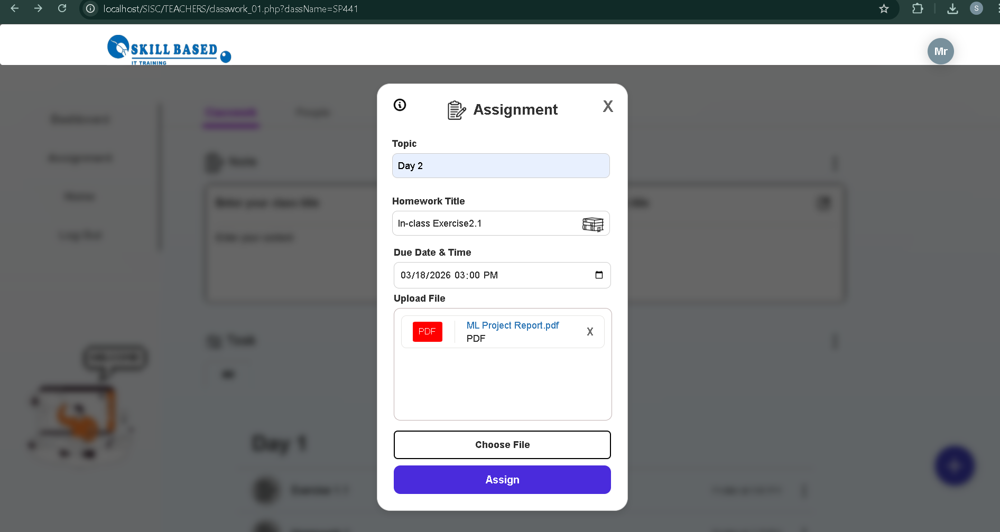
   
  <i>(Teacher Interface: Create New Assignment)</i>

  

  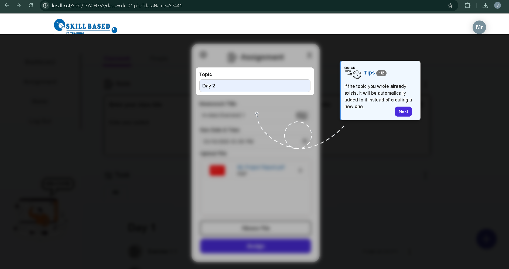
   
  <i>(Teacher Interface: Assignment Guidelines)</i>

  

  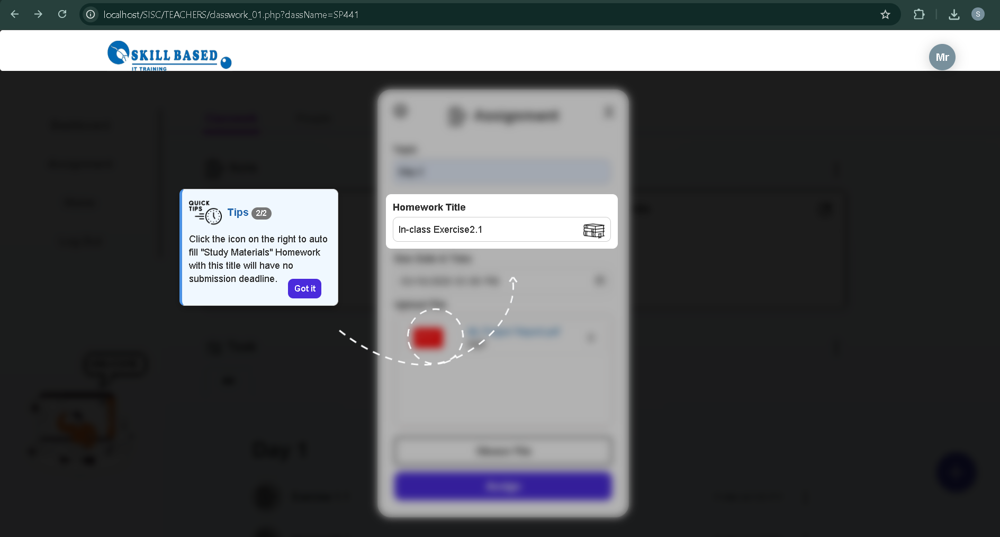
   
  <i>(Teacher Interface: Assignment Guidelines)</i>

  

  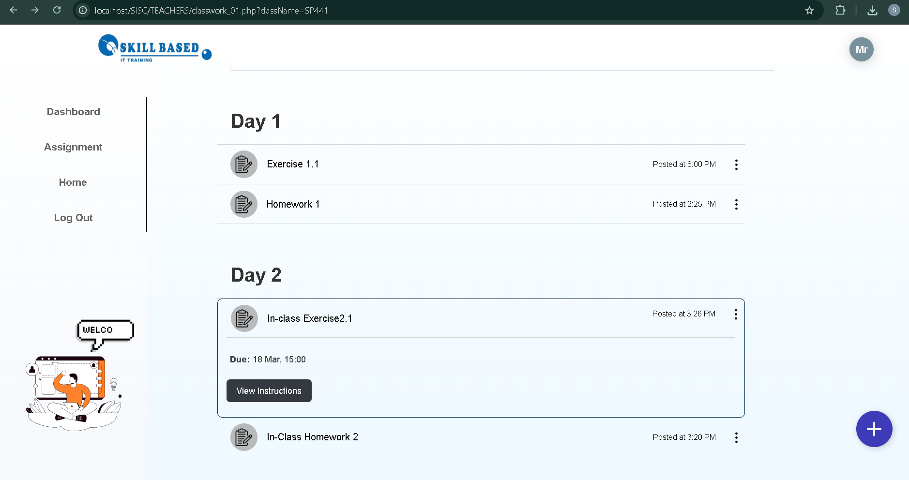
   
  <i>(Teacher Interface: Student Submissions View)</i>

  

  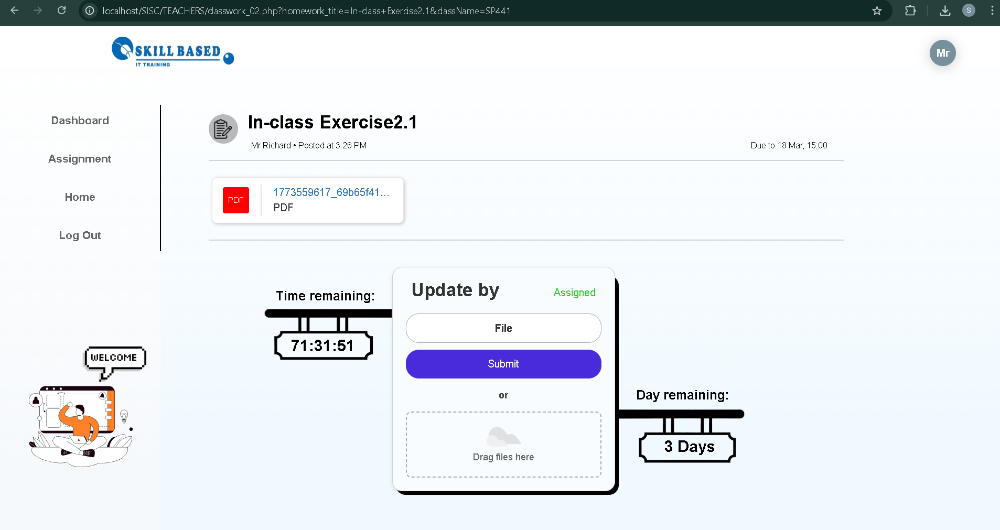
   
  <i>(Teacher Interface: File Update & Management)</i>

  

  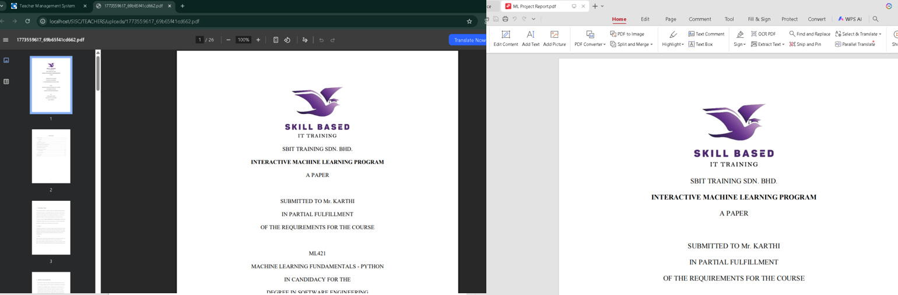
   
  <i>(Teacher Interface: View Assignment)</i>

  

  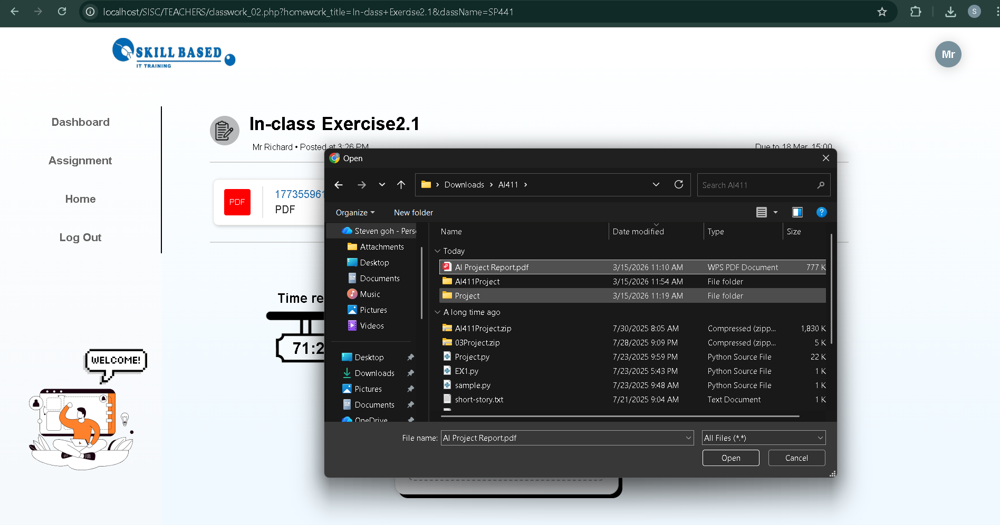
   
  <i>(Teacher Interface: Update File Function)</i>

  

  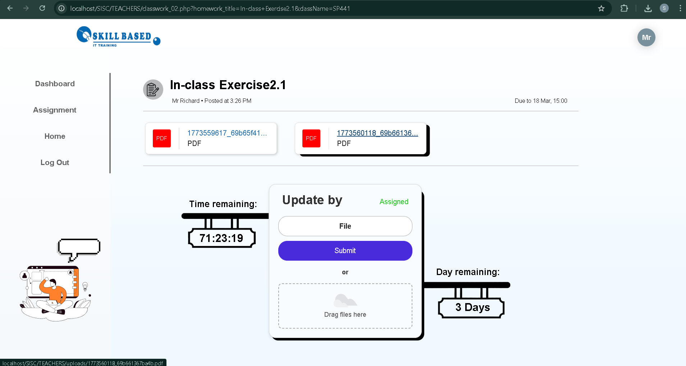
   
  <i>(Teacher Interface: Update File Function)</i>

  

  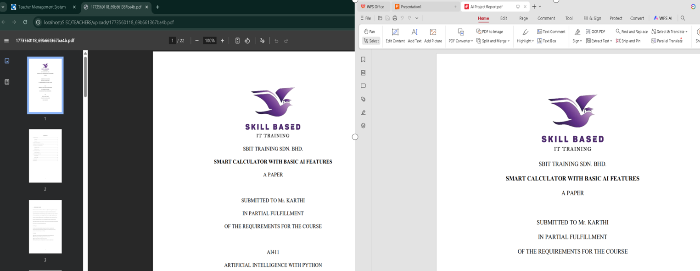
   
  <i>(Teacher Interface: Update File & View)</i>

  

  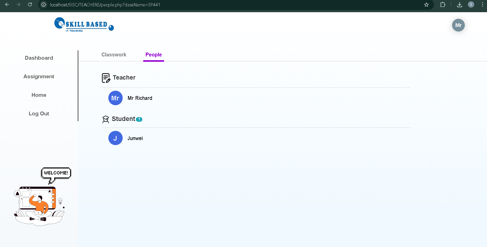
   
  <i>(Teacher Interface: Class Members & Student List)</i>

  

## 👨‍🎓 Project Presentation Design (Student Interface)

  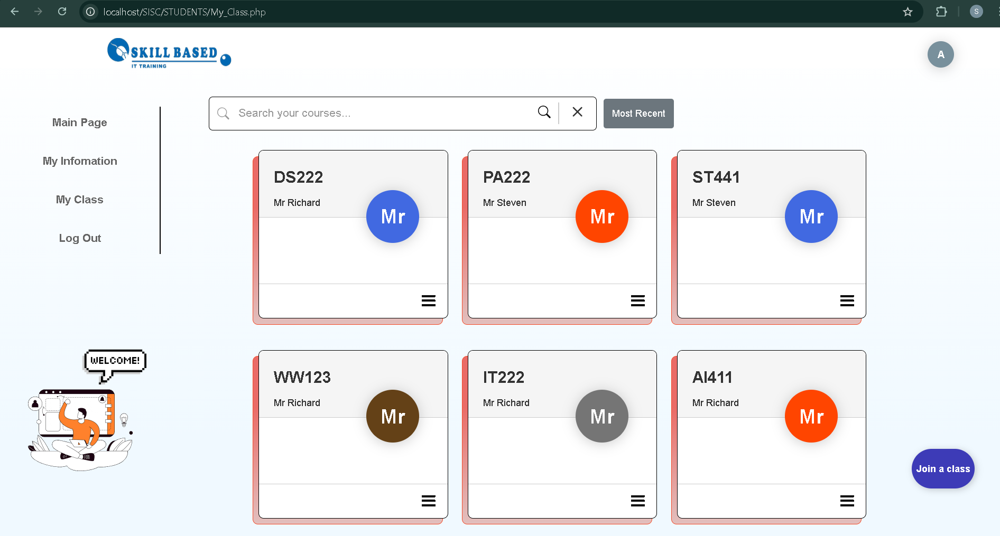
   
  <i>(Student Interface: Dashboard Home)</i>

  

  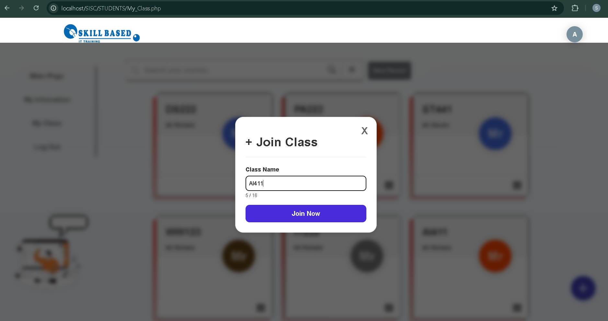
   
  <i>(Student Interface: Class Management / Join New Class)</i>

  

  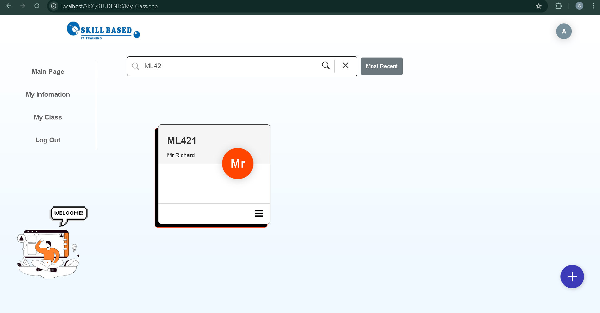
   
  <i>(Student Interface: Class Search & Enrollment)</i>

  

  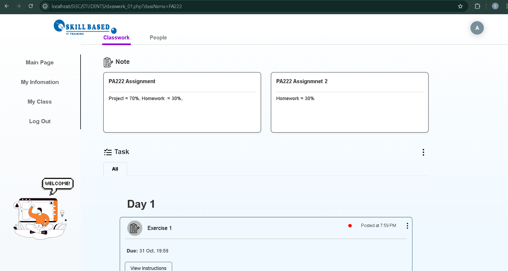
   
  <i>(Student Interface: Assignment Overview)</i>

  

  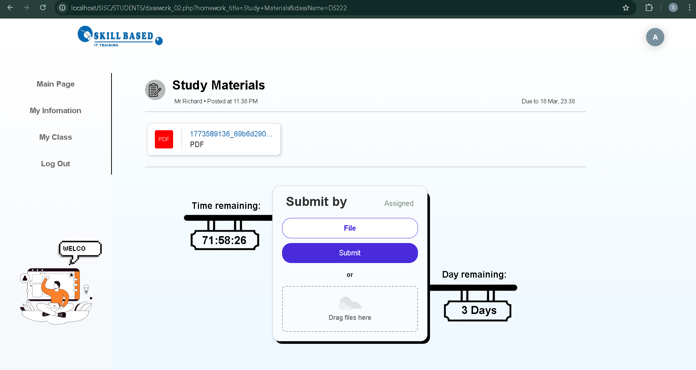
   
  <i>(Student Interface: Pending Assignment View)</i>

  

  
   
  <i>(Student Interface: Completed Submission View)</i>

  

  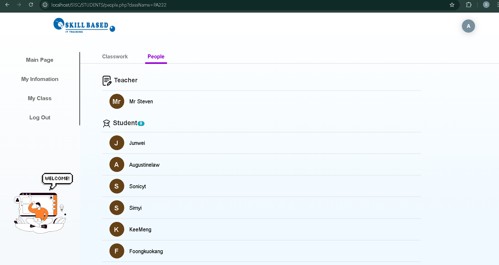
   
  <i>(Student Interface: Class Members & Student List)</i>

 

## Contact

> **Degree Final Year Project** &nbsp; | &nbsp; Completed on Nov 26, 2025  
> *Developed with passion for Software Engineering.*
